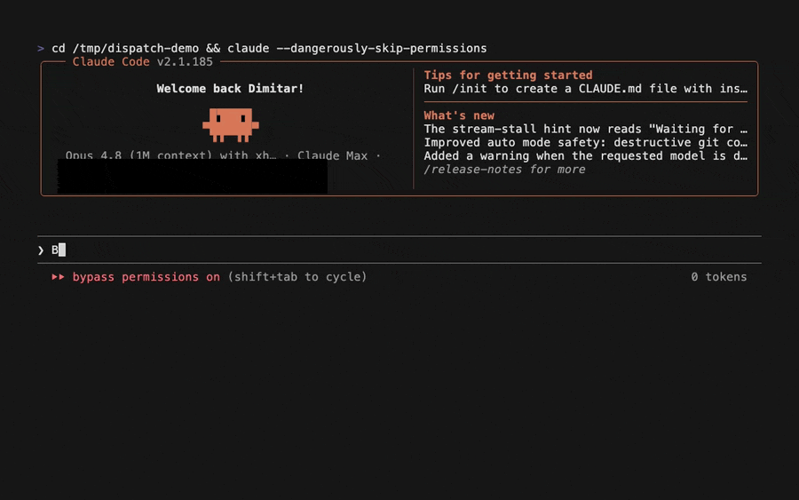
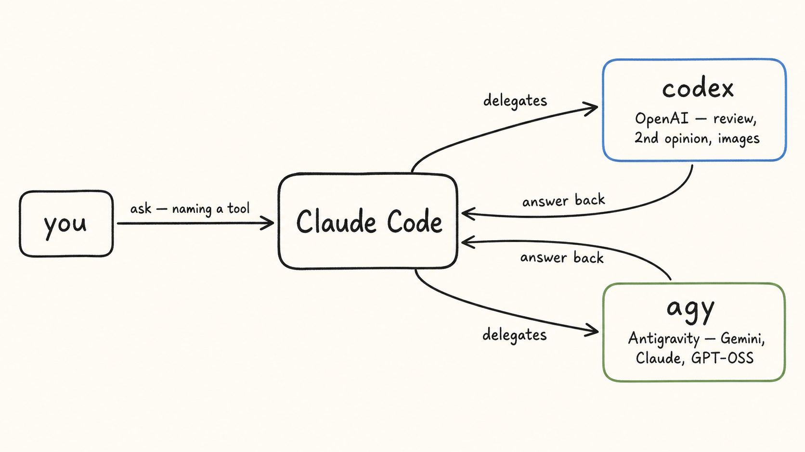

# sparkling-skills

> **Give Claude Code a second opinion - without leaving the terminal.**
> The `dispatch` plugin lets Claude run **Codex** and **Gemini** *for* you, show you what they said, and reconcile it - second opinions, parallel checks, side tasks, images. Coding and non-coding work alike.

<p align="center">
  
</p>
<p align="center"><sub><em>A real <code>dispatch</code> run on a sample migration — sped up, model wait trimmed.</em></sub></p>

**Stop asking one model to grade its own homework.** Claude reviewed the migration and called it safe. Codex and Gemini took an independent look - one caught a data-loss path on the retry. Claude verified it against the code, dropped the two false alarms, and fixed the real bug.

```
/plugin marketplace add sparklingneuronics/sparkling-skills
/plugin install dispatch@sparkling-skills
```

*Free - OAuth / Google sign-in, no API keys stored · Windows · macOS · Linux · [MIT](LICENSE)*

> Community plugins for Claude Code (an Anthropic product). Not affiliated with Anthropic. Published by [Sparkling Neuronics](https://sparklingneuronics.ai) · [GitHub](https://github.com/sparklingneuronics).

### Why not just…

| | alt-tab to ChatGPT/Gemini | a model router (OpenRouter, Aider) | an autonomous "AI council" | **dispatch** |
|---|:---:|:---:|:---:|:---:|
| Stay inside Claude Code | ❌ copy-paste | ⚠️ separate tool | ⚠️ separate agent | ✅ |
| Independent take from *rival* frontier models | ✅ by hand | ✅ you swap models | ✅ | ✅ |
| Claude stays the driver and **referees** the result | ❌ you reconcile | ❌ | ❌ vote/merge | ✅ |
| No API keys - uses each tool's own login | ✅ | ❌ key + markup | varies | ✅ |
| Per-topic, resumable cross-model threads | ❌ | ❌ | ⚠️ | ✅ |

---

## dispatch

*Delegate to OpenAI Codex and Google Antigravity (`agy`) from inside Claude Code.*

Stop alt-tabbing to ChatGPT or Gemini to sanity-check Claude - then pasting the context over, and the answer back. **dispatch** lets Claude run the other AI CLI *for* you, show you what it said, and reconcile it: a second opinion, a side task, a parallel check, or an image - without leaving Claude Code, for coding and non-coding work alike.

| Skill | Delegates to | Use it for | Needs |
|-------|--------------|------------|-------|
| `/codex` | OpenAI **Codex** CLI (`codex exec`) | second opinions, review, refactors, research, images | `codex` CLI + `codex login` |
| `/agy` *(also `/gemini`)* | Google **Antigravity** CLI (`agy`) - **multi-model**: Gemini 3.x, Claude 4.6, GPT-OSS | second opinions, review, refactors, research, images | Antigravity + Google sign-in |

Each skill keeps a **separate conversation per topic** (so "continue with codex" resumes the right thread), treats the other model as a **peer, not an authority**, and runs **only when you name it** - a bare "review this" or "create an image" won't auto-delegate.

> **Invoking the commands:** they're namespaced under the plugin, so the reliable form is `/dispatch:codex`, `/dispatch:agy`, `/dispatch:gemini`. (You can also just **name the tool in plain language** - "ask codex …", "check with agy …" - which is the usual way to use it.)

> **Why `agy` and not `gemini`?** Google deprecated gemini-cli's free individual tier and points users to **Antigravity** - its multi-model agent CLI. So `/agy` is the working successor, and it does *more*: one flag routes your task to a Gemini, Claude, or GPT-OSS model. `/gemini` still works as a familiar alias - it runs through `agy` on a Gemini model.

> `dispatch` wraps the Codex and Antigravity CLIs, which you install and authenticate yourself - no API keys are stored (both use OAuth / a Google sign-in). Not affiliated with OpenAI or Google; Codex, Gemini, and Antigravity are their respective trademarks.

### Requirements

- **Claude Code** (the plugin runs inside it).
- **For `/codex`:** the [`codex` CLI](https://github.com/openai/codex), authenticated with `codex login`.
- **For `/agy` (and `/gemini`):** Google **Antigravity** with the `agy` CLI on your PATH, signed in with a free Google account ([antigravity.google](https://antigravity.google)).

Install only the CLI(s) for the skill(s) you want - one or both. After [adding the marketplace](#the-sparkling-skills-marketplace) and installing the plugin, **reload when prompted.**

### See it work

**Name the tool.** dispatch runs only when you explicitly say "codex", "agy", or "gemini" - so it never hijacks an ordinary request. You don't manage models, sessions, or flags; just ask in plain language. The loop is always the same: **you ask - Claude runs the other CLI - Claude shows you what came back and reconciles it.**

#### See it once

> **You:** "I keep getting a Next.js hydration mismatch. **Check with codex** before I start ripping things out."
>
> **Claude:** *Asking codex (read-only)...* runs `codex exec "review this hydration error..."`
>
> **Codex:** "You've got an `<a>` wrapping a `<div>` - invalid HTML, and the usual cause of this exact error."
>
> **Claude:** "Codex spotted it - the `<a>`/`<div>` nesting is the hydration mismatch, not your data fetching. Want me to swap it to a `<span>`?"

That's the whole point: Claude stays in the driver's seat, uses the other model as a tool, and hands you a reconciled answer - no alt-tab, no copy-paste.

#### A second opinion before you commit

> "Before I merge, **ask codex** to review this diff for anything we missed - regressions, unsafe assumptions."

**→ Result:** codex confirms the logic but flags an unhandled `null` on the retry path; Claude agrees, fixes it, and drops the two "issues" codex raised that don't actually apply. (Works on non-code too: *"check with gemini - is this reply to a client too blunt?"*)

#### Triangulate a decision - across tools *and* models

When the call matters, get more than one engine. `agy` makes this especially rich, because it answers as different models:

> "I'm torn between Postgres and DynamoDB here. **Ask codex, and ask agy with Claude Opus**, then tell me where you all agree and disagree."

**→ Result:** all three agree Postgres fits your access patterns; they split on hot-partition risk; Claude lays out the one disagreement that actually changes your call. (Add *"and a quick Gemini take"* for a fourth.)

#### Generate and iterate on an image

> "**Use agy to create an image** - a few retro robots squabbling over a laptop while one calmly takes notes."
> then: "make the note-taker bigger - that one's me."

agy generates it natively (no API key); Claude shows it, and the follow-up resumes the same thread to edit it. Both tools do this - here's an actual dispatch run:


<details>
<summary><strong>More examples</strong> - offload a side task, red-team a change, resume a thread, run both in parallel</summary>

#### Offload a side task while you keep going

> "Let's keep refactoring this `Auth` class. **Meanwhile, have codex write a fuzz harness** for it into `tests/fuzz.ts`."

**→ Result:** you and Claude stay on the refactor while codex writes the harness on the side - it lands in `tests/fuzz.ts` covering the new constructor and the token-refresh path, no context-switch.

#### Red-team a risky change

> "**Have codex red-team this migration** for data-loss risks before I run it - what would you do to break it?"

**→ Result:** codex finds the backfill retry can clobber newer writes; Claude confirms that one against the migration, drops two weaker warnings, and recommends an idempotency guard before you ship.

#### Resume an earlier topic later

codex and agy remember separate conversations by topic, so you can switch tasks and come back without re-pasting:

> "Ask codex to review the auth design." ... later: "**Continue with codex** on auth - we swapped JWTs for server-side sessions; does that resolve its concern?"

**→ Result:** Claude resumes the matching thread, bridges what changed, and brings back codex's updated verdict - your billing and deploy threads stay separate, no cross-contamination.

#### Advanced: run both in parallel

> "**Have codex and agy each** research our options for edge rate-limiting, write to its own file under `research/`, then reconcile them into `research/synthesis.md` - flag where they disagree."

**→ Result:** two `research/*.md` files plus a `synthesis.md` that diffs them - codex leans on one risk, agy another, with the disagreements flagged. (What each can see depends on its web access - see the FAQ.)

</details>

### How it works



- **Delegation, not impersonation.** Claude shows you the actual `codex` / `agy` command and the result; any edits land as normal untracked changes for you to review.
- **Topic-aware sessions.** Each topic gets its own external conversation, resumed by id, so follow-ups land in the right thread.
- **Peer, not authority.** Claude cross-checks the other model and pushes back when it disagrees - you decide.
- **Mind the safety model.** Codex defaults to **read-only**. `agy` is **agentic - it can edit files and run commands by default** (there's no read-only flag), so dispatch asks it to analyze-only for second opinions and surfaces any changes via `git status`. No API keys - both use OAuth / Google sign-in.

### Uninstall

```
/plugin uninstall dispatch@sparkling-skills
```

(To remove the whole marketplace: `/plugin marketplace remove sparkling-skills`.)

### FAQ

#### Do I need API keys?
No. Codex uses OAuth (`codex login`); `agy` uses a free Google account (Antigravity sign-in). The plugin never stores or passes keys.

#### What happened to Gemini?
Google deprecated gemini-cli's free individual tier (it now errors with `IneligibleTierError`) and points users to **Antigravity**. So dispatch delegates Gemini work through Antigravity's `agy` instead - which also runs Claude and GPT-OSS models. `/gemini` still works: it's an alias that routes through `agy` on a Gemini model.

#### Does it work on Windows?
Yes - it's pure Claude Code, with no bundled shell scripts. The one requirement on Windows is **Git for Windows**: Claude Code runs the commands through its Git Bash, so the same POSIX commands work across Windows, macOS, and Linux. (Without Git Bash it falls back to PowerShell, where they won't.)

#### Heads up - can `agy` change my files?
Yes. Unlike Codex (read-only by default), `agy` is agentic and acts by default. For a second opinion dispatch asks it to analyze only and shows you any edits via `git status` - but it *can* write files and run commands, so treat it like a capable teammate, not a read-only oracle.

#### Can I install just one skill?
The `dispatch` plugin bundles both, but each triggers only when you name its tool and needs only its own CLI. Install just the `codex` CLI and you'll only ever use `/codex`.

#### Why doesn't "create an image" or "review this" trigger it?
By design. dispatch runs only when you explicitly name **codex**, **agy**, or **gemini**, so it never hijacks a request meant for Claude itself (or for another tool). Name the tool to delegate.

#### Which model does it use?
Codex `gpt-5.5`. `agy` defaults to Gemini 3.5 Flash - or name one inline: "ask agy with Claude Opus", "a quick Gemini take", "with GPT-OSS". Defaults are stated up front so you can override.

---

## The sparkling-skills marketplace

`dispatch` is the first plugin - more land as they're ready. Add the marketplace once, then install whichever plugins you want:

```
/plugin marketplace add sparklingneuronics/sparkling-skills
```

(or `claude plugin marketplace add sparklingneuronics/sparkling-skills` from your shell).

| Plugin | What it does | Install |
|--------|--------------|---------|
| [**`dispatch`**](#dispatch) | Second opinions from Codex & Gemini, parallel checks, side tasks, images | `/plugin install dispatch@sparkling-skills` |

## Maintenance

Actively maintained - issues and pull requests welcome. Verified against **codex-cli 0.141.0** and **agy (Antigravity) 1.0.10**; each skill re-checks its documented commands against the installed CLI, so it fails loudly rather than silently when a CLI changes.

## License

[MIT](LICENSE). Covers the plugins and documentation in this repository only - not the Codex or Antigravity CLIs, or any software they download or run.
